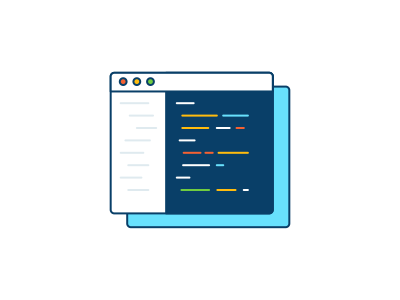

<h1 align= "center">Hi there , It's Haoran! </h1> 

I am a senior student double majoring in Computer Science and Applied Mathematics at <b>Boston University</b>  . My professional passions are centered on <b>Software Engineer</b>!.

I have a full year of individual full stack development Experience involving web development  and mobile development . I'm also an enthusiat on machine learning, reinforcemnet learning and trying all cutting-edged frameworks! 

## my Skill Stack

<table>
<thead>
<tr>
<th>Programming Language and framworks</th>
<th>Projects</th>
</tr>
</thead>
<tbody>
<tr>
<td>ReactJs, NextJs, TailwindCSS, Three</td>
<td><a href="https://github.com/SHRmsks/MyWebsite" target="_blank">Personal Webpage </a>
</td>

</tbody>
</table>

